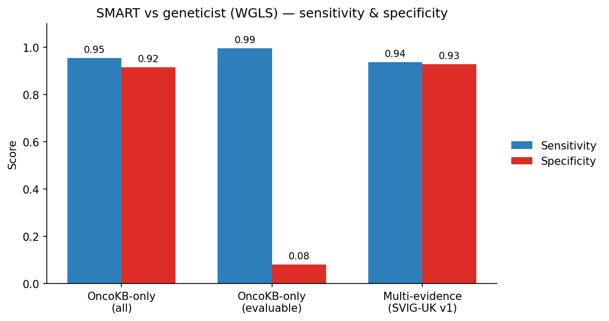

# SMART — Somatic Mutation Annotation and Reporting Tool <a href="#"></a>

<p align="center"><em>A Dockerised pipeline for somatic variant annotation, filtration, and clinical reporting.</em></p>

[](https://doi.org/10.5281/zenodo.20206503)
[](https://github.com/Manuel-DominguezCBG/SMART/tree/main/tests)

---

## Overview

SMART automates the end-to-end processing of somatic VCF files. Starting from raw VCFs (hg19/GRCh37 or hg38), it performs PASS filtering, optional coordinate liftover to GRCh38, comprehensive functional annotation via Ensembl VEP, clinical annotation via OncoKB, and produces final analysis-ready tables with transcript-prioritised results in three audience-targeted output tiers.

Everything runs inside a single Docker container.

---

## Workflow

<p align="center">
  
</p>

A streamlined framework for somatic variant annotation and clinical reporting.
SMART (Somatic Mutation Annotation and Reporting Tool) integrates sequential processing of somatic variants from input VCF files through quality filtering, optional liftover to GRCh38, and comprehensive functional annotation with Ensembl VEP. A key feature is transcript-level prioritisation using a curated NM whitelist to focus on clinically relevant isoforms. Variants are subsequently enriched with therapeutic, diagnostic and prognostic evidence via API-driven OncoKB annotation. Structured parsing of annotation layers enables standardisation and feature extraction, followed by tiering and filtering to produce report-ready outputs. The framework generates MAF and tabular outputs optimised for both bioinformatic analysis and clinical interpretation. While SNVs and indels are robustly supported, annotation of structural variants remains limited.

| Step | Tool | What happens |
|------|------|-------------|
| 1. PASS Filter | bcftools / awk | Keep only PASS-filtered variants |
| 2. LiftOver | GATK 4.6 | hg19 → hg38 coordinate conversion (optional) |
| 3. VEP Annotation | Ensembl VEP 114 | Functional annotation with SpliceAI, REVEL, ClinVar, CIViC, CancerHotspots, LOEUF plugins |
| 4. OncoKB Annotation | oncokb2.0.py | Per-variant clinical annotation via OncoKB REST API (mutations + CNAs) |
| 5. VCF → Table | vcf2table.py | Transcript-prioritised CSV with all VEP + OncoKB fields |
| 6. MAF Annotation | MafAnnotator | OncoKB MafAnnotator for standardised MAF output |
| 7. Post-Analysis | post_analysis.py | Merge samples, expand JSON fields, apply tier filtering, produce final outputs |

---

## Transcript Selection Strategy

Both the OncoKB annotator and the table generator use the same 3-tier logic to ensure the transcript shown in the final output matches the one used to query OncoKB:

**Tier 1 — Preferred List:** Does the annotation contain a RefSeq NM ID (version-agnostic) found in the transcript whitelist provided at runtime?

**Tier 2 — MANE Select / MANE Plus Clinical:** If no Tier 1 match, use the transcript tagged as MANE Select or MANE Plus Clinical by Ensembl/NCBI.

**Tier 3 — Fallback:** If neither applies, use the first transcript reported by VEP.

This logic applies to both SNV/indel and CNA variants, ensuring consistent gene selection when multiple transcripts overlap a region.

---

> [!NOTE]
> **v1.0.0 — multi-transcript output: one row per preferred transcript**
>
> When a variant overlaps more than one transcript in the preferred whitelist, the pipeline
> now produces **one output row per matching transcript**, each with its own VEP annotation
> and independent OncoKB query.
>
> This is clinically significant for genes with multiple biologically distinct isoforms.
> The canonical example in the TSO500 panel is **CDKN2A**:
>
> - `NM_000077.5` — p16/INK4A (CDK4/6 inhibitor; MANE Select)
> - `NM_058195.4` — p14ARF (MDM2/TP53 pathway; MANE Plus Clinical)
>
> A variant affecting both isoforms now appears **twice** in the output — once for each
> isoform — with the correct protein change and OncoKB evidence level for each.
> The `NM_Transcript` column identifies which isoform each row represents.

---

## What's Inside the Container

| Tool | Version | Purpose |
|------|---------|---------|
| GATK | 4.6.0.0 | LiftOver (hg19 → hg38) |
| Ensembl VEP | 114.2 | Functional annotation |
| SpliceAI plugin | 1.3 | Splice-site impact prediction |
| REVEL plugin | 1.3 | Missense pathogenicity scoring |
| bcftools / samtools / tabix | System | VCF manipulation |
| Python 3.10 | + pandas, cyvcf2, requests | Pipeline scripts |
| OncoKB Annotator | Latest | MafAnnotator for MAF output |

---

## Prerequisites

- **Docker** (v20.10+ or Docker Desktop)
- **OncoKB API token** — obtain from [oncokb.org](https://www.oncokb.org)
- **Reference files** downloaded and organised (see below)

---

## Reference Files Setup

SMART expects a reference directory with the following structure:

```
/path/to/refs/
├── liftover/
│   ├── hg19ToHg38.over.chain       # UCSC chain file
│   └── hg38.fa                      # GRCh38 reference genome + .fai + .dict
├── Plugins/                         # VEP plugin files (SpliceAI.pm, REVEL.pm, LOEUF.pm)
├── SpliceAI/
│   ├── spliceai_scores.raw.snv.hg38.vcf.gz      (+.tbi)
│   └── spliceai_scores.raw.indel.hg38.vcf.gz    (+.tbi)
├── REVEL/
│   └── new_tabbed_revel_grch38.tsv.gz            (+.tbi)
├── ClinVar/
│   └── clinvar.vcf.gz                            (+.tbi)
├── CIVIC/
│   └── civic_grch38.vcf.gz                       (+.tbi)
├── gnomAD_constraints/
│   └── loeuf_dataset_grch38.tsv.gz               (+.tbi)
├── CancerHotSpots/
│   └── hg38.hotspots_changv2_gao_nc.vcf.gz      (+.tbi)
└── homo_sapiens/                    # VEP cache directory
    └── 114_GRCh38/
```

All reference files can be downloaded using the provided `utils/get_ref_files.sh` script (see [utils/README.md](utils/README.md)).

---

## Quick Start

### 1. Clone and build

```bash
git clone https://github.com/Manuel-DominguezCBG/SMART.git
cd SMART
docker build -t smart:latest .
```

### 2. Add your data

```bash
mkdir -p data/OriginalVcf
cp /path/to/your/*.vcf.gz data/OriginalVcf/
cp /path/to/transcripts_list.txt data/
```

### 3. Run

```bash
export ONCOKB_TOKEN=your_token_here

docker run --rm \
  -v /path/to/your/input:/data \
  -v /path/to/your/output:/results \
  -v /path/to/your/refs:/refs:ro \
  monkiky/smart:latest \
  "$ONCOKB_TOKEN" \
  --transcripts-file /data/transcripts_list.txt \
  --config /data/Config.yaml \
  --ref-dir /refs \
  --output-dir /results \
  --input-dir /data \
  --no-liftover \
  --keep-tmp \
  --keep-tables
```

For example, using the verification1 test set:

```bash
docker run --rm \
  -v /path/to/SMART/tests/verification1:/data \
  -v /path/to/SMART/tests/verification1/output:/results \
  -v /path/to/refs:/refs:ro \
  monkiky/smart:latest \
  "$ONCOKB_TOKEN" \
  --transcripts-file /data/verification1_transcripts.txt \
  --config /data/Config.yaml \
  --ref-dir /refs \
  --output-dir /results \
  --input-dir /data \
  --no-liftover \
  --keep-tmp \
  --keep-tables
```

Or with docker compose (edit `docker-compose.yml` volume paths first):

```bash
docker compose run --rm smart
```


---

## Command-Line Options

```
Usage:
  smart <ONCOKB_TOKEN> --transcripts-file FILE --ref-dir DIR [OPTIONS]

Required:
  <ONCOKB_TOKEN>                   OncoKB API token
  --transcripts-file FILE          Transcript whitelist for prioritisation
  --ref-dir DIR                    Reference resources directory

Options:
  --pass / --no-pass               Enable/disable PASS filtering (default: ON)
  --liftover / --no-liftover       Enable/disable hg19→hg38 liftover (default: ON)
  --clean-tmp / --keep-tmp         Delete/keep intermediate files (default: clean)
  --clean-tables / --keep-tables   Delete/keep per-sample tables after
                                   post_analysis merging (default: clean)
  --jobs N                         Number of samples to process in parallel on this
                                   machine (default: 1 = sequential). Requires
                                   internet access for OncoKB — not suitable for
                                   HPC compute nodes without internet.
  --vep-only                       Stop after VEP annotation. Skips OncoKB,
                                   vcf2table, MafAnnotator, and post-analysis.
                                   VEP-annotated VCFs are written to AnnotatedVcf/.
                                   --transcripts-file and --config are not required
                                   in this mode.
  --help                           Show help
```

---

## Output

All results are written to the mounted `/data` directory:

| File | Description |
|------|-------------|
| `variant_counts.txt` | Per-sample variant counts at each pipeline stage |
| `Output_Results/` | Final merged results from post-analysis |

### Output tiers

The pipeline produces three audience-targeted output files:

| File | Audience | Contents |
|------|----------|----------|
| `Final_result_tier1.maf` | Downstream tools | All non-dropped fields in standard MAF format (~1028 columns; exact count varies with the number of OncoKB treatment, diagnostic, and prognostic entries returned for the variants in the run) |
| `Final_result_tier2.tsv` | Bioinformaticians | Selected fields with two-row header (field names + metadata) |
| `Final_result_tier3.tsv` | Clinical scientists | Clinically relevant fields with two-row header |

When `--keep-tmp` is used, intermediate files are retained:

| Directory | Contents |
|-----------|----------|
| `FilteredVcf/` | PASS-only VCFs |
| `LiftOverVcf/` | hg38-lifted VCFs |
| `LiftOverVcf/Rejected/` | Variants that failed liftover |
| `AnnotatedVcf/` | VEP-annotated VCFs |
| `OncoKB_VCF/` | OncoKB-annotated VCFs |
| `Table/` | Per-sample CSV tables |
| `FINAL_Table/` | Per-sample MAF files |

---

## Example Output

The example below is taken from the [verification1](tests/verification1/) test run — 18 curated variants from a single sample. The variant shown is **IDH1 R132H**, a well-characterised oncogenic hotspot with OncoKB Level 1 actionability in glioma and cholangiocarcinoma.

> **[Browse the full verification1 output interactively →](https://manuel-dominguezcbg.github.io/SMART/example-output.html)**
> All three tier files (Tier 3: 77 cols · Tier 2: 670 cols · Tier 1: 1,028 cols) rendered as searchable,
> sortable tables with colour-coded OncoKB levels and per-tier column visibility controls.

---

### Tier 3 — Clinical report &nbsp;(`Final_result_tier3.tsv` · 77 columns)

Optimised for clinical scientists. One row per variant, curated fields only, two-row header (field names + source metadata).

| Field | Value |
|-------|-------|
| Sample | `TUMOR` |
| Gene | `IDH1` |
| Variant (short) | `p.R132H` |
| Variant (full) | `ENSP00000260985.2:p.Arg132His` |
| Transcript | `NM_005896` |
| Genomic location (GRCh38) | `chr2:208,248,388` |
| Change | `C > T` |
| Consequence | `missense_variant` |
| Variant class | `SNV` |
| VAF | `0.326` &nbsp;(30 alt / 92 total reads) |
| ClinVar significance | `Pathogenic / Likely pathogenic` |
| ClinVar oncogenicity | `Oncogenic · Tier I – Strong` |
| CancerHotspots | hotspot confirmed |
| OncoKB oncogenicity | `Oncogenic` |
| Mutation effect | `Switch-of-function` |
| OncoKB hotspot | `True` |
| **Highest level** | **`LEVEL_1`** |
| Level 1 treatments | `Ivosidenib · Olutasidenib · Vorasidenib` |
| Level 2 treatments | `Ivosidenib` |
| Diagnostic level | `LEVEL_Dx2` |
| REVEL score | `0.852` |
| SpliceAI max delta | `0.04` |
| LOEUF | `0.829` |
| gnomAD max AF | `3.83 × 10⁻⁵` (gnomADe_ASJ) |

---

### Tier 2 — Bioinformatics report &nbsp;(`Final_result_tier2.tsv` · 670 columns)

Extends Tier 3 with:
- Full gnomAD population stratification (exomes + genomes, 7 ancestry groups)
- All four SpliceAI delta scores (AG, AL, DG, DL) per variant
- Complete structured ClinVar and CIViC fields (variant type, consequence, disease, therapies, evidence level, AMP category)
- Expanded OncoKB JSON arrays — every treatment, diagnostic, and prognostic implication is unpacked into indexed columns (`ONCOKB_TX_0_level`, `ONCOKB_TX_0_drugs`, `ONCOKB_TX_0_tumorType`, `ONCOKB_DIAG_0_level`, …)

For **IDH1 R132H** this adds 15 structured treatment entries across three tumour types, two diagnostic entries, and two prognostic entries.

Intended for bioinformatics QC, cohort-level analysis, and integration with downstream pipelines.

---

### Tier 1 — Full MAF &nbsp;(`Final_result_tier1.maf` · 1,028 columns)

Standard MAF format carrying all non-dropped fields. Includes every `ONCOKB_TX_0` … `ONCOKB_TX_33` treatment expansion column, every diagnostic and prognostic implication entry, plus all raw VCF FORMAT fields.

> **Note on the column count.** The OncoKB treatment, diagnostic, and prognostic implications are expanded into indexed columns (`ONCOKB_TX_0` … `ONCOKB_TX_33`, `ONCOKB_DIAG_*`, `ONCOKB_PROG_*`). To avoid emitting a large block of permanently empty columns, this expansion is **pruned dynamically**: only the index positions populated for at least one variant in the run are kept. The canonical full count is **1,028 columns**. Consequently the exact number varies with the breadth of OncoKB evidence returned for that specific set of variants — and if *none* of the variants in a given analysis populate any of the dynamic OncoKB expansion columns, the count can fall to roughly **800**. A lower count is therefore expected behaviour for small or low-evidence variant sets, not a pipeline error. The same dynamic pruning applies to Tier 2.

Designed for direct input to downstream tools such as cBioPortal, oncoPrint generators, and custom R/Python analysis scripts.

---

## Output Annotations (~1028 columns) — [Full field reference →](https://manuel-dominguezcbg.github.io/SMART/fields/)

The final table includes annotations from multiple sources. Key field groups:

**Core VCF:** CHROM, POS, ID, REF, ALT, QUAL, FILTER, FORMAT

**VEP Functional:** Consequence, IMPACT, SYMBOL, HGVSc, HGVSp, BIOTYPE, EXON, INTRON, SIFT, PolyPhen, VARIANT_CLASS, CANONICAL, MANE_SELECT, MANE_PLUS_CLINICAL

**Population Frequency:** gnomADe/gnomADg allele frequencies across populations, MAX_AF

**Splice & Pathogenicity:** SpliceAI delta scores (AG/AL/DG/DL), REVEL missense score, LOEUF constraint

**Clinical Databases:** ClinVar (significance, review status, conditions), CIViC (variant type, consequence), CancerHotspots (hotspot and 3D hotspot flags)

**OncoKB Core:** Oncogenic classification, mutation effect, gene/variant exist flags, hotspot, VUS flag, gene and variant summaries

**OncoKB Therapeutic Levels:** LEVEL_1 through LEVEL_R2, HIGHEST_SENSITIVE_LEVEL, HIGHEST_RESISTANCE_LEVEL, HIGHEST_LEVEL, ONCOKB_highestFdaLevel

**OncoKB Diagnostic/Prognostic:** ONCOKB_DIAG_LVL, ONCOKB_PROG_LVL, ONCOKB_diagnosticSummary, ONCOKB_prognosticSummary

**OncoKB Expanded JSON:** Treatment, diagnostic, and prognostic implication entries are expanded from JSON arrays into individual columns (e.g. `ONCOKB_TX_0_level`, `ONCOKB_TX_0_drugs`, `ONCOKB_DIAG_0_level`, `ONCOKB_PROG_0_tumorType`, etc.), producing hundreds of additional columns for full structured access.

---

## Variant Classification

SMART classifies variants to route them to the correct OncoKB API endpoint:

| Variant Type | Examples | OncoKB Endpoint |
|-------------|----------|-----------------|
| Mutations | SNVs, indels, MantaINS, MantaBND | `/annotate/mutations/byProteinChange` |
| Copy Number | MantaDUP, MantaDEL, GAIN, LOSS | `/annotate/copyNumberAlterations` |

Structural insertions (MantaINS) are intentionally routed to the mutation endpoint because they alter gene sequence and produce specific protein changes (e.g. EGFR Exon 20 insertions) that require distinct targeted therapies, unlike simple gene dosage changes.

### CNA annotation

For copy-number variants, SMART applies the same 3-tier transcript selection logic to determine the correct gene symbol before querying OncoKB. This prevents misannotation in regions where multiple genes overlap (e.g. selecting CDKN2A over the adjacent CDKN2B for a 9p21 deletion).

Because MafAnnotator does not correctly annotate CNA rows, the pipeline's post-analysis step overrides MafAnnotator's output for CNA variants with values derived directly from the OncoKB API: `VARIANT_IN_ONCOKB`, `ONCOGENIC`, `MUTATION_EFFECT`, all treatment levels, and `HIGHEST_SENSITIVE/RESISTANCE_LEVEL`.

---

## Validation against expert classification

SMART's calls were benchmarked against an independent expert classification: the WGLS oncology team manually classified **1,054 onco-related variants across 58 genes** following SVIG-UK. Two classifiers were compared: the current OncoKB-only verdict (`MY_VERDICT`) and an experimental multi-evidence SVIG-UK scorer that also folds in ClinVar, REVEL/SpliceAI, gnomAD frequency, hotspots and gene constraint.

Binary task, positive = geneticist (Likely) Oncogenic:

| Classifier | N | Sens | Spec | Weighted κ |
|---|---|---|---|---|
| OncoKB-only, all variants | 1,054 | 0.953 | 0.915 | 0.63 |
| OncoKB-only, evaluable (OncoKB had data) | 539 | 0.994 | **0.080** | — |
| Multi-evidence (SVIG-UK v1) | 1,054 | 0.937 | 0.928 | **0.74** |

> **Weighted κ** is Cohen's kappa with linear weights over the ordinal Benign < VUS < Oncogenic scale. It measures agreement with the geneticist *above chance*, penalising each disagreement by how far apart the two calls are — an Oncogenic↔Benign mismatch (2 steps) counts double an Oncogenic↔VUS one (1 step). Unlike raw accuracy it discounts the trivial agreement created by OncoKB's no-data→VUS abstentions, which is why it is used as the headline metric here. By the Landis & Koch convention 0.61–0.80 is "substantial" agreement; the multi-evidence gain (0.63 → 0.74) comes mostly from fixing benign-side 2-step errors.

### Confusion counts (TP / TN / FP / FN)

SMART is treated as **positive** when it calls a variant (Likely) Oncogenic, with the geneticist's classification as ground truth. Every variant then falls into one of four cases:

- **TP — true positive:** SMART called it oncogenic *and* the geneticist agrees → a correctly flagged actionable variant.
- **FP — false positive:** SMART called it oncogenic but the geneticist did not → an over-call (often defensible — see the tumour-type caveat below).
- **TN — true negative:** SMART did **not** call it oncogenic *and* neither did the geneticist → a correctly *not*-flagged variant.
- **FN — false negative:** SMART did not call it oncogenic but the geneticist did → a **missed** actionable variant, the most clinically important error.

**OncoKB-only, all variants (N = 1,054)**

| | Expert **+** | Expert **−** | |
|---|---|---|---|
| **Test +** | TP = 486 | FP = 46 | PPV = 486/(486+46) = **0.914** |
| **Test −** | FN = 24 | TN = 498 | NPV = 498/(24+498) = **0.954** |
| | Sens = 486/(486+24) = **0.953** | Spec = 498/(498+46) = **0.915** | |

**OncoKB-only, evaluable — OncoKB had data (N = 539)**

| | Expert **+** | Expert **−** | |
|---|---|---|---|
| **Test +** | TP = 486 | FP = 46 | PPV = 486/(486+46) = **0.914** |
| **Test −** | FN = 3 | TN = 4 | NPV = 4/(3+4) = **0.571** |
| | Sens = 486/(486+3) = **0.994** | Spec = 4/(4+46) = **0.080** | |

**Multi-evidence, all variants (N = 1,054)**

| | Expert **+** | Expert **−** | |
|---|---|---|---|
| **Test +** | TP = 478 | FP = 39 | PPV = 478/(478+39) = **0.925** |
| **Test −** | FN = 32 | TN = 505 | NPV = 505/(32+505) = **0.940** |
| | Sens = 478/(478+32) = **0.937** | Spec = 505/(505+39) = **0.928** | |

**The TN caveat — why the "evaluable" row matters.** The TN column of the first row (498) looks like a strong negative class, but it is misleading. **515 of the 1,054 variants have no OncoKB data at all** and default to VUS, i.e. "not oncogenic" — so almost all of those 498 TN are *abstentions*, not genuine "this is benign" judgements. When the count is restricted to the **539 variants OncoKB actually has data for**, the TN collapses to **4**: OncoKB almost never makes a confident non-oncogenic call, so its negative class is essentially untested. A high TN (and therefore high specificity) in the all-variants row is largely an artefact of OncoKB's missing data, not evidence that it discriminates benign variants. The multi-evidence scorer instead reaches **505 TN** by *actively* classifying those data-less variants, which is exactly where its specificity gain (0.92 → 0.93) comes from.

Key findings:

- **Coverage drives the headline numbers.** 48.9% (515/1,054) of variants have no OncoKB data and default to VUS. Those abstentions count as "true negatives" in the all-variants row, inflating specificity. On the 539 variants OncoKB *actually* has data for, specificity collapses to **0.08** — OncoKB almost never calls a variant non-oncogenic, so its negative class is essentially untested. Always report coverage alongside accuracy.
- **Multi-evidence adds value on the benign side.** Per-class agreement with the geneticist for benign variants rises from 0% (OncoKB-only) to 98% (multi-evidence), lifting specificity (0.92 → 0.93) and weighted kappa (0.63 → 0.74).
- **Missed oncogenic calls are recovered by COSMIC (O4).** The false negatives are dominated by OncoKB-blind variants that are nonetheless recurrent in tumours. Enabling the optional COSMIC somatic-recurrence track (evidence code O4) is the single change that recovers them — see *Impact of COSMIC* below.



**Impact of COSMIC (O4).** With the optional COSMIC Cancer Mutation Census track enabled, the multi-evidence scorer gains a somatic-recurrence signal (code O4). On this set it recovers **5 expert-oncogenic variants** the scorer otherwise missed (TET2 ×2, U2AF1, BTK, PHF6 — all recurrent in COSMIC, sample counts 14–57) at a cost of **2 new false positives**, lifting **sensitivity 0.937 → 0.951** and **weighted kappa 0.74 → 0.754** with specificity essentially unchanged (0.928 → 0.925). This is precisely the evidence OncoKB lacks: of the variants OncoKB has no data for, COSMIC covers ~40% — and ~70% of the *oncogenic* ones. (COSMIC is licence-gated and optional; see [utils/cosmic_cmc_to_vcf.py](utils/cosmic_cmc_to_vcf.py).)

The SVIG-UK multi-evidence scorer used here is included as methodology in `data/jack_list_validation/validation_report/` (`score_multievidence_inplace.py`, `smart_multievidence.py`). The curated variant set itself was constructed by the reference laboratory and is **not redistributed** with this repository; it is available on request.

> The geneticist labels are tumour-type specific while SMART/OncoKB is tumour-agnostic, so some "false positives" are defensible rather than errors. This caveat affects the false-positive count more than the false-negative count.

### Class harmonisation

OncoKB, the geneticist (WGLS, 5-class SVIG-UK) and the multi-evidence scorer use
different label spaces, so all three were mapped onto a common Oncogenic / VUS / Benign
scale before comparison:

| Source | → Oncogenic (ONC) | → VUS | → Benign (BEN) |
|--------|-------------------|-------|----------------|
| OncoKB-only (`MY_VERDICT`) | `Oncogenic`, `Likely Oncogenic` | `Unknown` / no data | `Likely Neutral`, `Neutral` |
| Geneticist (`WGLS`) | `Oncogenic`, `Likely Oncogenic` | `VUS` | `Likely Benign`, `Benign` |
| Multi-evidence | `Oncogenic`, `Likely Oncogenic` | `VUS` | `Likely Benign`, `Benign` |

For the binary metrics, **positive = (Likely) Oncogenic** on both sides.

### Multi-evidence scoring scheme (SVIG-UK v1)

Each variant accrues points from independent evidence axes; the codes (`O*`/`B*`) follow
the ACGS / SVIG-UK 2025 framework. Points are additive **across** axes but mutually
exclusive **within** an axis (only the strongest tier of each axis fires).

| Evidence | Code | Points |
|----------|------|-------:|
| OncoKB `Oncogenic` | O10 | +10 |
| OncoKB `Likely Oncogenic` / `Resistance` | O10 | +6 |
| ClinVar `Pathogenic` | O10 | +5 |
| ClinVar oncogenicity flag = `Oncogenic` | O10 | +4 |
| ClinVar `Likely pathogenic` | O10 | +3 |
| Loss-of-function (frameshift / stop-gain / splice, `HIGH` impact) | O2 | +4 |
| Mutational hotspot (OncoKB **or** CancerHotspots) | O7 | +2 |
| Absent from gnomAD | O3 | +2 |
| Ultra-rare (gnomAD MAX_AF ≤ 1e-5) | O3 | +1 |
| In-silico damaging (REVEL ≥ 0.7 **or** SpliceAI ≥ 0.2) | O6 | +1 |
| Constrained gene (LOEUF < 0.6) | O8 | +1 |
| COSMIC recurrence — tier 1 / ≥50 samples *(optional)* | O4 | +4 |
| COSMIC recurrence — tier 2 / ≥20 samples *(optional)* | O4 | +3 |
| COSMIC recurrence — ≥10 / ≥5 samples *(optional)* | O4 | +2 / +1 |
| OncoKB `Likely Neutral` | B6 | −4 |
| OncoKB `Neutral` | B6 | −7 |
| ClinVar `Benign` | B6 | −5 |
| ClinVar `Likely benign` | B6 | −3 |
| Common (gnomAD MAX_AF ≥ 1%) | B1 | −8 |
| Sub-common (gnomAD MAX_AF ≥ 0.1%) | B1 | −4 |
| In-silico benign (REVEL < 0.7 **and** SpliceAI < 0.1) | B3 | −1 |
| Synonymous change | B4 | −4 |

The summed score maps to a 5-class verdict:

| Score | Verdict |
|-------|---------|
| ≥ 10 | Oncogenic |
| 6 … 9 | Likely Oncogenic |
| 0 … 5 | VUS |
| −6 … −1 | Likely Benign |
| ≤ −7 | Benign |

*Example — DNMT3A R882H (a canonical hotspot):* OncoKB `Oncogenic` (+10) + ClinVar
`Pathogenic` (+5) + ClinVar oncogenic flag (+4) + hotspot (+2) + in-silico damaging (+1)
= **22 → Oncogenic**. Each variant's fired codes are written to an `EVIDENCE_CODES`
column so the score is auditable by eye.

This is a **v1 approximation** of SVIG-UK: it implements O2 (conservatively, no
tumour-suppressor mode-of-action check), O3, O6, O7, O8, O10, B1, B3, B4 and B6, plus
**O4** (somatic recurrence, scored from COSMIC sample counts / significance tier) when
the optional COSMIC track is enabled. Codes needing data not present in the MAF are
still **not** implemented — O5, O9, O11, B2, B5 and B7. Thresholds follow the documented
framework; calibration is not independently validated against the certified WGLS pipeline.

> The point values in the **Evidence / Code / Points** table above were assigned by a bioinformatician, not a geneticist, and were fixed *before* this validation was run — the numbers have **not** been adapted to fit the geneticist's classifications. They are a reasonable first pass rather than a calibrated model, and there is clear room for improvement: with further work (ideally geneticist-led) the weights could be refined to track real-world classification more closely. It should also be kept in mind that SMART's annotation is tumour-agnostic, whereas the geneticists' classification is tumour-specific, so the two are not expected to align perfectly. Even with these limitations, this validation meets its objective: to gauge, in broad terms, how closely SMART's output approximates the reality represented by the geneticist's classification — and the encouraging result is that OncoKB alone, supplemented by a handful of additional annotation columns, already yields a good approximation.

---

## Tumor Type Handling

SMART supports two modes for OncoKB tumour type context:

**`--tumor_mode filename`** (default in standalone script): Parses the input filename against a built-in cancer type dictionary to infer the tumour type for context-specific evidence levels.

**`--tumor_mode generic`** (default in Docker entrypoint): Omits `tumorType` from API queries for pan-cancer annotation, which returns broader evidence including FDA levels and treatment levels across all tumour types.

Supported filename-inferred types: brain, breast, cholangiocarcinoma, colon, endometrial, HNSC, SNUC, lung, melanoma, ovarian, pancreatic, prostate, renal, sarcoma, thyroid.

---

## Versioning

The pipeline version is recorded in the `VERSION` file at the repository root. It is printed in the terminal banner at the start of every run and written as the first line of every output MAF file (`#SMART_VERSION x.y.z`), making each result file self-describing and traceable to a specific release.

To check the version bundled in a Docker image:

```bash
docker run --rm monkiky/smart:latest cat /app/VERSION
```

---

## Tool Versions

| Component | Version |
|-----------|---------|
| SMART | see `VERSION` |
| VCF format | 4.2 |
| GATK LiftoverVcf | 4.6.0.0 |
| Ensembl VEP | 114.2 |
| OncoKB | 5.4 |
| SpliceAI | 1.3 |
| REVEL | 1.3 |
| CIViC | nightly |
| Reference genome | GRCh38 (Homo sapiens 114) |

---

## Utility Scripts

The `utils/` directory contains standalone helper scripts that operate **outside** the Docker container. See [utils/README.md](utils/README.md) for full details.

| Script | Purpose |
|--------|---------|
| `get_ref_files.sh` | Download and prepare all reference files required by the pipeline |
| `civic_formating.py` | Convert CIViC nightly TSV into a bgzip-compressed, tabix-indexed VCF for VEP |
| `get_oncokb_transcripts.py` | Fetch the canonical transcript (NM accession) OncoKB uses for every curated gene and write a ready-to-use transcript whitelist |

---

## Testing & Verification

The `tests/` directory contains four independent verification suites plus a shared utility. All automated suites can be run together:

```bash
export ONCOKB_TOKEN=your_token_here
bash tests/run_all_verifications.sh
```

To run a single suite:

```bash
bash tests/run_all_verifications.sh --only verification1
bash tests/run_all_verifications.sh --only verification3
bash tests/run_all_verifications.sh --only verification4
```

---

### Verification 1 — Field-level API verification

Located in `tests/verification1/`. Contains 18 curated variants (14 SNV/indel + 4 CNA) covering key clinical scenarios across NRAS, IDH1, PIK3CA, EGFR, BRAF, GNAQ, PTEN, KRAS, BRCA2, DICER1, TP53, ERBB2, MET, CDKN2A, and CDK4.

After running the pipeline, `verify.py` cross-checks the MAF output against live external APIs:

- **OncoKB module** — queries `oncokb.org/api/v1` for each variant; compares 23 fields including oncogenicity, mutation effect, all treatment/FDA/diagnostic/prognostic levels, and summaries
- **VEP module** — queries `rest.ensembl.org` for each SNV/indel; compares 14 fields including consequence, HGVSc/HGVSp, SIFT, PolyPhen, exon number, and canonical flag
- **CIViC module** — queries the CIViC GraphQL API for each variant; compares variant type, consequence, gene, and clinical significance

All modules report PASS / MISMATCH per field with a coverage report identifying which fields were testable and which were always empty.

```bash
python tests/verification1/verify.py \
    --maf  tests/verification1/output/output/Final_result_tier1.maf \
    --token $ONCOKB_TOKEN \
    --output tests/verification1/results.tsv
```

See `tests/verification1/README.md` for full details.

---

### Verification 2 — Variant caller compatibility

Located in `tests/verification2/`. Tests the pipeline against VCFs from four different variant callers (GATK MuTect2, Strelka, SomaticSniper, Pisces) using SEQC2 benchmark samples, verifying that SMART correctly handles different VCF formats, FILTER field conventions, and column orderings. This suite is run manually (see `tests/verification2/README.md`).

---

### Verification 3 — Transcript prioritisation impact

Located in `tests/verification3/`. Demonstrates that the preferred-transcript whitelist meaningfully changes the VEP annotation output and, downstream, the OncoKB clinical interpretation. The pipeline is run twice on the same three-variant VCF using two different transcript files, then `verify.py` confirms:

1. **DIFFER** — targeted variants produce different VEP annotations between runs (the whitelist drives annotation selection)
2. **PASS** — each run's annotation is confirmed correct by the Ensembl REST API for the expected transcript
3. **OncoKB impact** — the annotation difference propagates to a different clinical result (e.g. LEVEL_1 vs Unknown, CDKN2A LEVEL_4 vs CDKN2B with no level)

| Variant | Transcript A | Result A | Transcript B | Result B |
|---|---|---|---|---|
| EGFR L858R | NM_005228.5 (MANE) | p.Leu858Arg (LEVEL_1) | NM_001346897.2 | p.Leu813Arg (Unknown) |
| TP53 R175H | NM_000546.6 (MANE) | p.Arg175His (hotspot) | NM_001126115.2 | p.Arg43His (not a hotspot) |
| CDKN2A/B DEL | NM_058195.4 | CDKN2A (LEVEL_4) | NM_004936.4 | CDKN2B (no level) |
| FGFR1 N546K | NM_023110.3 (MANE) | p.Asn546Lys (Unknown) | NM_001174067.2 (TSO500 non-MANE) | p.Asn577Lys (Likely Oncogenic, LEVEL_4 — false positive) |

```bash
export ONCOKB_TOKEN=your_token_here
bash tests/verification3/run_verification3.sh
```

See `tests/verification3/README.md` for full details.

---

### Verification 4 — Parallel job processing (`--jobs`)

Located in `tests/verification4/`. Verifies that `--jobs N` correctly processes
multiple samples in parallel on a single machine, producing identical output to a
sequential run.

The `--jobs N` flag runs up to N samples concurrently as background processes on
the **same machine**, sharing its CPU and RAM. It is not distributed computing —
all jobs run inside the same Docker container. This is designed for machines with
internet access, since OncoKB requires internet connectivity that is typically
unavailable on HPC compute nodes.

The test copies `verification1.vcf.gz` twice under different sample names and
runs with `--jobs 2`. `verify.py` confirms — without any external API calls:

- Both per-sample log files exist in `logs/` and contain the completion marker
- `variant_counts.txt` has exactly one data row per sample (count-merge worked)
- Both output MAFs exist and are content-identical after excluding
  `Tumor_Sample_Barcode` (same input → same annotations)

```bash
export ONCOKB_TOKEN=your_token_here
bash tests/verification4/run_verification4.sh
```

See `tests/verification4/README.md` for resource guidance and implementation details.

---

### verify_maf.py — Expected variant presence

`tests/verify_maf.py` checks that specific known variants are present in a MAF output with the correct ID values. Used as a quick sanity check after a pipeline run.

---

### Verification 5 — Unit tests (pure logic, no Docker required)

Located in `tests/verification5/`. A pytest-based unit test suite targeting the pure-Python logic in the three core pipeline scripts. **No Docker, no OncoKB token, and no reference files are needed** — the suite runs in any standard Python environment in under one second.

```bash
cd tests/verification5
python3 -m pytest . -v
```

#### What is tested

| Script | Functions tested |
|--------|-----------------|
| `vcf2table.py` | `calculate_end` (all variant classes), `convert_hgvsp_short` (3→1 letter AA conversion), `load_nm_transcripts` (version stripping, edge cases) |
| `oncokb2.0.py` | `get_cancer_from_filename`, `clean_value`, `stringify_list`, `_extract_one_letter_protein`, `classify_variant` (all SVTYPE + MantaID combinations), `map_svtype_to_cna`, `load_preferred_transcripts`, `get_csq_index`, `parse_csq_format` |
| `post_analysis.py` | `load_field_config`, `resolve_field_meta` (exact + wildcard pattern), `standardize_format_column`, `normalize_format_fields`, `add_vaf_column`, `clean_column_values`, `calculate_end_position`, `drop_columns` |

**147 tests, all passing.** Real variants from the verification1 dataset (NRAS Q61R, IDH1 R132H, PIK3CA E545K/H1047R, BRAF V600E, TP53 R175H/R248W, EGFR exon 19 deletion) are used as parametrised ground-truth cases.

#### Code coverage

Coverage is measured over the pure-Python lines of each script. Lines excluded from coverage are those that require Docker, a live OncoKB API connection, or a real VCF file to execute (the main pipeline loops — `annotate_vcf`, `merge_maf_files`, `main` — and the HTTP query functions).

| Script | Statements | Covered | **Coverage** |
|--------|-----------|---------|--------------|
| `vcf2table.py` | 216 | 40 | **19%** |
| `oncokb2.0.py` | 401 | 122 | **30%** |
| `post_analysis.py` | 342 | 108 | **32%** |
| **Total** | **959** | **270** | **28%** |

The uncovered lines are concentrated in three pipeline orchestrators (`main`, `annotate_vcf`, `merge_maf_files`) and the OncoKB HTTP query functions. These are exercised end-to-end by verifications 1–4. The unit tests cover **100% of the pure, stateless logic** that can be tested without external infrastructure.

To reproduce the coverage report:

```bash
cd tests/verification5
python3 -m pytest . --cov=../../scripts --cov-report=term-missing
# HTML report (open coverage_html/index.html in a browser):
python3 -m pytest . --cov=../../scripts --cov-report=html:../../coverage_html
```

---

## Troubleshooting

**"Required resource not found"**
Check that your `--ref-dir` volume mount is correct and the expected subdirectory structure exists. All `.vcf.gz` reference files need accompanying `.tbi` index files.

**Out of memory**
VEP annotation can be memory-intensive. Adjust the memory limit in `docker-compose.yml` under `deploy.resources.limits.memory`, or pass `--memory=32g` to `docker run`.

**VEP cache missing**
The VEP cache (`homo_sapiens/114_GRCh38/`) must exist inside your ref-dir. Download from Ensembl FTP and extract.

**Permission errors on output files**
The container runs as root by default. To match your host user:
```bash
docker run --rm -u $(id -u):$(id -g) ...
```

**OncoKB API errors**
Verify your token is valid and has not expired. The pipeline logs API errors to stderr — check your log file for `OncoKB mutation API ERROR` messages.

**Empty VCF after PASS filtering**
Some samples may have zero PASS variants. The pipeline will process these without error but the sample will show 0 counts in `variant_counts.txt`.

**CNA variants showing Unknown oncogenicity**
Ensure you are using an up-to-date build. Earlier versions of MafAnnotator incorrectly overwrote CNA annotation with Unknown values. The post-analysis step now corrects this automatically using values from the OncoKB API.

---

## License

This project is licensed under the MIT License — see the [LICENSE](LICENSE) file for details.

Copyright (c) 2026 University Hospital Southampton
